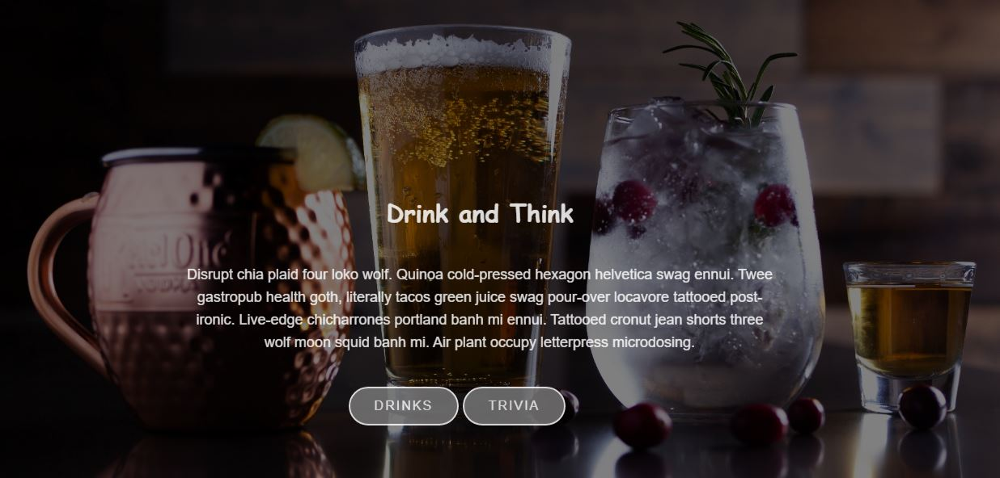

# Drink-and-Think

Welcomes to Drink & Think!


Who doesn't want to have fun making drinks from Home during the Curent State of Lockdown the Country is facing. So, why not create an application that allows the end-user to make drinks from scratch and play a game of Trivia once they have a Cold One, on hand!

Drink and Think is a user friendly application that allows the end-user to search for drink recipes and play a fun game of Trivia so, come and play!

Our Web-API based application allows the user to search for items by name, ingridient or create a random drink. The Foundation CSS bring sharp and precise colors to the page. 

The search results will provide a varaiety of drink recipes. Trivia allows the user to keep score of the game and saves high scroes. 

```
Logic for Drink and Think:

Technology:
1.HTML
2.CSS- Foundation and Materialized CSS Framework
3.Javascript
4.JQuery
5.Slack
6.Git/GitHub
7.Web-API's
```




- - -
© 2020 Drink & Think, Inc. brand. All Rights Reserved.