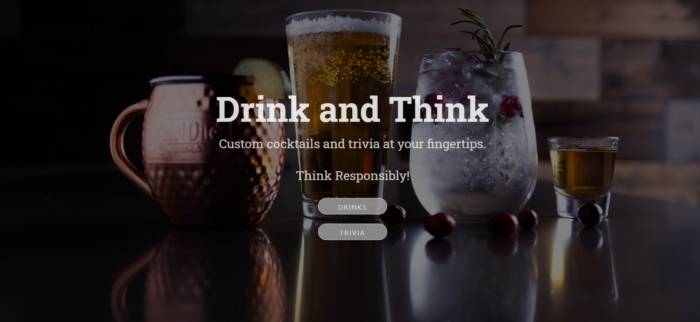
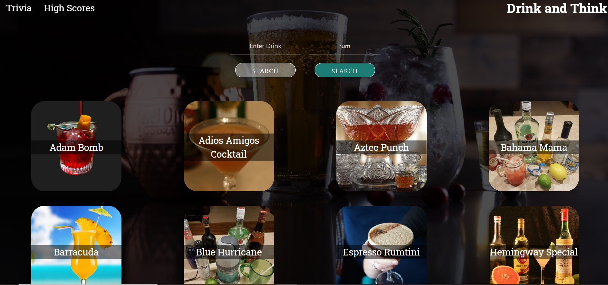
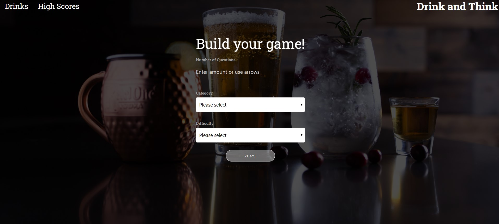
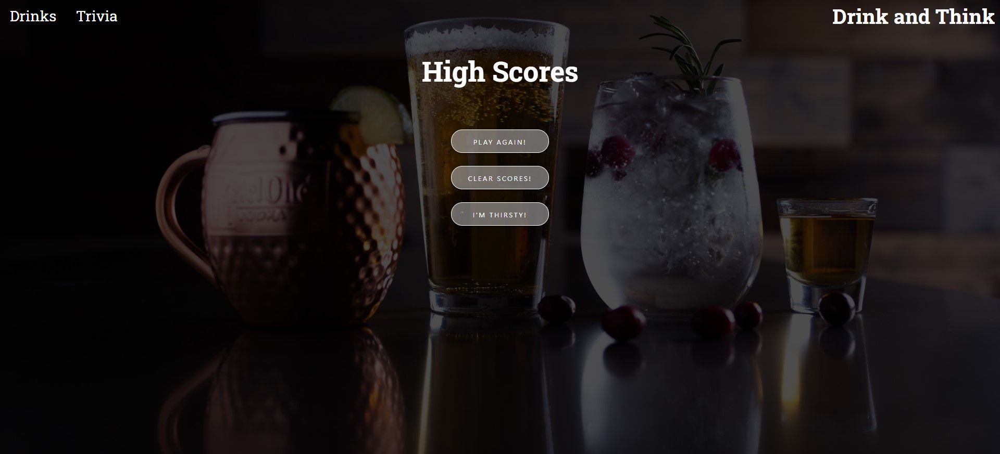

# Drink-and-Think

## Welcomes to Drink & Think!


### Description

Drink and Think uses The Cocktail Database to provide the user with a vast array of alcoholic and non alcoholic beverages. While simultaneously allowing them to craft a custom trivia game for themselves and others using The OpenTrivia Database. 

### Motivation for Development

During this quarantine people are unable to go to bars and be social. Many people now are using Zoom and other screencasting programs to spend time with friends and family online. While in these Zoom or Facetime calls people are looking for fun ways to be entertained together. 

### User Story

As a person that loves Pub Trivia, I want a way to create custom cocktails and play Pub Trivia anywhere I have access to the internet. So that I can have the Pub Trivia experience with friends and family over Zoom or other screencasting calls. 


```
Logic for Drink and Think:

Technology:
1. HTML
2. CSS
3. Javascript
4. JQuery
5. Slack
6. Materialized CSS Framework
7. The Cocktail Database (https://www.thecocktaildb.com/)
8. The OpenTrivia Database (https://opentdb.com/)
9. GitHub
10. Gitbash
```
### Site and Github
Deployed Site 
(https://mattkohl82.github.io/drink-and-think/)

Github Repo
(https://github.com/mattkohl82/drink-and-think)








